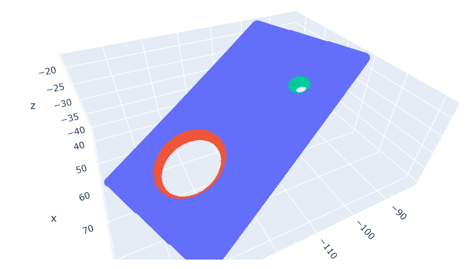

# Hole Detection for Point Clouds

## Usage

Build the solution with Visual Studio, then run `.\HoleDetection data-set.txt` where `data-set.txt` is your point cloud data, 
one point per line, space separated coordinates.

The program will output the center, radius and normals for all holes found to stdout. It will also create a `holeX.txt` which will 
will contain boundary points for the Xth hole found.

### Visualization

An IPython notebook is included that I use for testing and verification. The `holeX.txt` and the original dataset can be plotted 
to check if the program works correctly.

## References

- Bendels, G., R. Schnabel and R. Klein. "Detecting Holes in Point Set Surfaces." J. WSCG 14 (2006): 89-96.
- V. S. Nguyen, T. H. Trinh and M. H. Tran, "Hole Boundary Detection of a Surface of 3D Point Clouds," 
2015 International Conference on Advanced Computing and Applications (ACOMP), Ho Chi Minh City, 2015, pp. 124-129.
- PCL [tutorials](https://pcl.readthedocs.io/projects/tutorials/en/latest/index.html) and [documentation](https://pointclouds.org/documentation/index.html)
